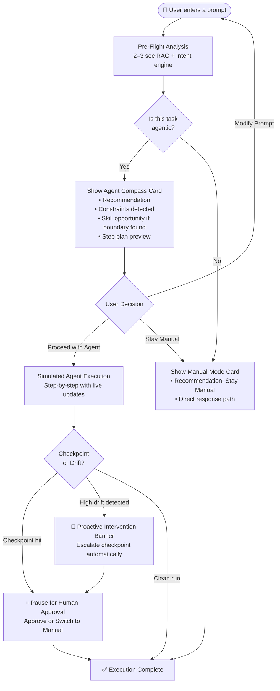
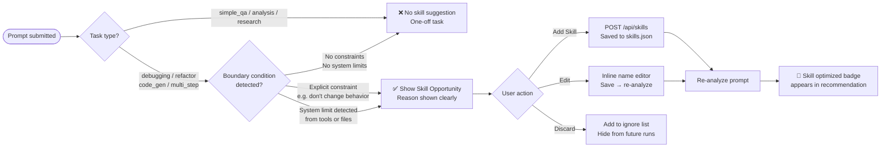
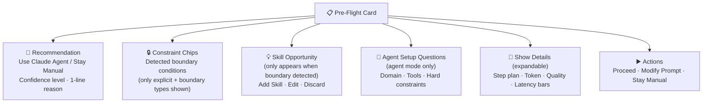
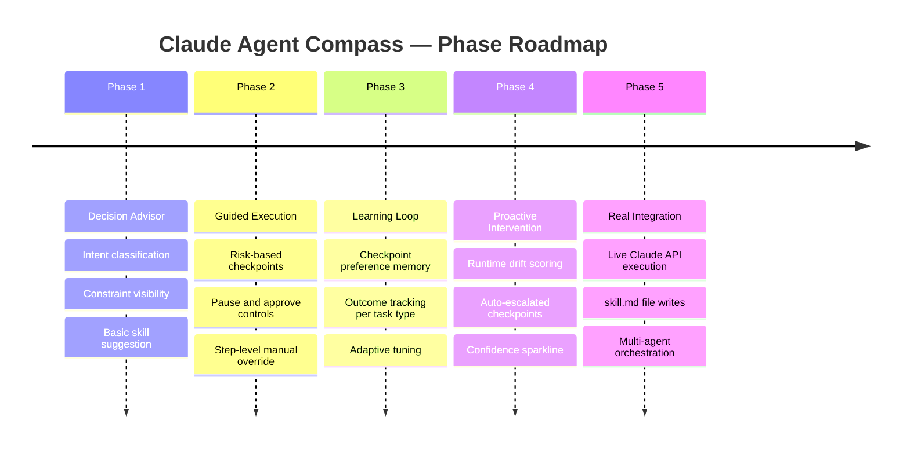

# Claude Agent Compass — Diagrams for Presentation

Copy any Mermaid block below into [mermaid.live](https://mermaid.live) to export as PNG/SVG for slides.

---

## 1. User Flow (PM-friendly — for stakeholder slides)



---

## 2. Skill Suggestion Flow (when it fires and when it doesn't)



---

## 3. System Architecture (Technical — for engineering slides)

```mermaid
flowchart TD
    subgraph Browser["🌐 Browser (Vite + TypeScript)"]
        UI[app.ts\nUI Logic + Event Binding]
        ENG[engine.ts\nRAG · Classification · Plan Builder]
        LLM[llm-service.ts\nOpenAI API optional]
        LS[(localStorage\nSkill Bank fallback\nLearning profiles)]
        UI --> ENG
        ENG --> LLM
        ENG <--> LS
    end

    subgraph Server["🖥 Node.js Server (Express)"]
        API[/api/skills\nGET · POST · PATCH · DELETE]
        FILE[(data/skills.json\nPersisted skill bank)]
        API <--> FILE
    end

    subgraph Vercel["☁️ Vercel Deployment"]
        STATIC[Static Frontend\ndist/ from vite build]
    end

    UI <-->|/api/skills calls\nFalls back to localStorage\nif server unavailable| API
    Browser --> Vercel
```

---

## 4. The 4-Engine Model (1-slide overview)

```mermaid
flowchart LR
    PR([Prompt]) --> E1

    subgraph E1["⚡ Engine 1\nIntent Router"]
        E1A[Classify: manual vs agentic]
        E1B[Estimate risk + complexity]
        E1C[Generate reasoning]
    end

    subgraph E2["🛡 Engine 2\nConstraint + Skill Engine"]
        E2A[Extract boundary conditions]
        E2B[Detect system limits]
        E2C[Suggest skill — only when\nboundary detected]
    end

    subgraph E3["🔔 Engine 3\nIntervention Engine"]
        E3A[Score confidence drift per step]
        E3B[Escalate checkpoints]
        E3C[Offer manual override]
    end

    subgraph E4["🧠 Engine 4\nLearning Profile"]
        E4A[Track outcomes by task type]
        E4B[Adapt checkpoint strictness]
        E4C[Tune confidence scoring]
    end

    E1 --> E2 --> Card([Pre-Flight Card])
    Card --> Exec([Agent Execution])
    Exec --> E3 --> E4
    E4 -->|Feeds back into| E1
```



---

## 5. Pre-Flight Card — Anatomy (UI breakdown for slides)



---

## 6. Phase Roadmap (Timeline for slides)



---

> **How to export for PPT:**
> 1. Go to [mermaid.live](https://mermaid.live)
> 2. Paste any block above
> 3. Click **Export → PNG** (transparent background) or **SVG**
> 4. Insert into PowerPoint / Google Slides as image
