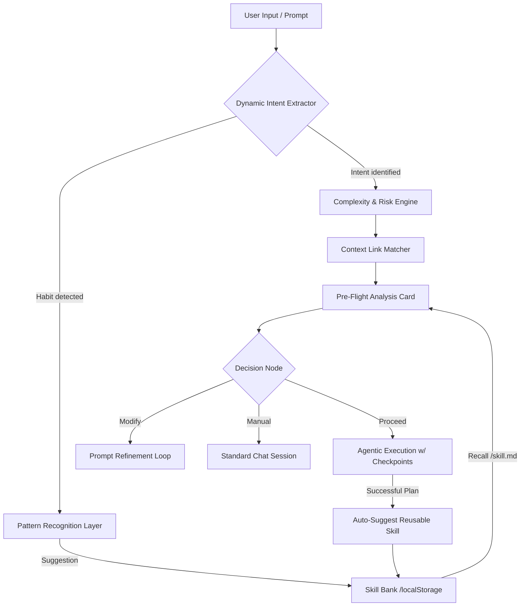

# 🛫 Agent Pre-Flight System

> **Product Solution for Claude's Agentic Capability Adoption**
> Submitted as part of the Growth PM Lens — Anthropic

---

## 🎯 Problem Statement

As Claude evolves beyond simple prompting, users can now perform complex tasks through **Skills, Agents, and Workflows**. But this introduces a new decision layer:

- Users **can't predict** when to use agentic mode vs manual prompting
- They **don't understand** what the agent will do before it starts
- They **waste tokens** through trial-and-error
- They **fail to adopt** advanced capabilities despite their potential

**The "Adoption Gap":** As Claude moves from a chatbot to an agent, users face a massive **Cognitive Burden**. They have to decide *if* they trust an agent with their codebase, *how* much it will cost, and *where* it might go wrong.

**Result:** Users stay in "Manual Mode" (~80% of the time), high failure rate (~35%), and 3.2 retries per task on average due to unpredictable execution.

---

## 🗺️ Capability Discovery: From "Chat User" to "AI Architect"

The core problem in Claude's agentic adoption is the **Discovery Gap**. Users treat Claude like a simple Q&A bot because they don't know it can be a **Project Manager**. Pre-Flight solves this through:

1.  **Just-in-Time Exposure:** When a user enters a prompt, Pre-Flight exposes the hidden "Agentic Engine." It shows them a multi-phase plan (Research, Architecture, Implementation) they didn't know Claude could execute.
2.  **The Heuristics of Delegation:** By recommending "Agent" vs "Manual" modes, the system teaches the user the "Mental Model" of an expert. It guides them to delegate complex work while staying manual for simple tasks.
3.  **Pattern Graduation:** The system "catches" users writing effective prompts and suggests converting them into **Deterministic Skills**. This guides the user to stop "talking to AI" and start **"building with AI."**

---

## 💎 The Strategic Value: Solving the "Decision Blind Spot"

This solution isn't just a UI card; it's a **Cognitive Bridge** between simple prompting and complex agentic work. It addresses the three main reasons users fail to adopt agents:

### 1. Predictability vs. "Black Box" Anxiety
*   **The Problem:** Hit "Enter" and hope for the best.
*   **The Solution:** Pre-Flight exposes the **Execution Plan** before a single token is spent. 
*   **User Guidance:** The user can see exactly where the agent will "Hypothesize," "Apply," or "Review," allowing them to add checkpoints where they feel most anxious.

### 2. Operational Efficiency (The Token Loop)
*   **The Problem:** Users repeatedly prompt for the same quality standards (e.g., "use clean code," "3 solutions").
*   **The Solution:** The system **Auto-Detects Habits** and suggests converting them into **Persistent Skills**.
*   **User Guidance:** It guides the user from being a "Prompt Writer" to being an "Operations Manager," saving ~30% in token costs through deterministic templates.

### 3. High-Stakes Confidence
*   **The Problem:** Agents modifying critical files without explicit "mental alignment" with the user.
*   **The Solution:** **Context-Aware Guardrails** that distinguish between "Reading" and "Writing."
*   **User Guidance:** It guides the user to set boundaries (e.g., "don't touch tests") *before* the agent starts, turning a high-risk task into a high-confidence one.

**Bottom Line:** Pre-Flight turns the Claude Agent from a "dynamic gambler" into a **"predictable professional."** It solves the Adoption Gap by providing the **informed decision-making** layer that is currently missing from agentic UX.

---

## 💡 Solution: Agent Pre-Flight

Before any agent executes, the system **analyzes the user's prompt** and presents a transparent **execution preview** — showing the plan, constraints, token budget, and risk level. The user then decides: **Proceed**, **Modify**, or **Switch to Manual**.

### How It Works

```
User Prompt → Task Classifier → Complexity Estimator → Constraint Extractor
                                                               ↓
                    Execution Preview ← Decision Engine ← Execution Planner
                                                               ↓
           [▶ Proceed]  [✏️ Modify]  [📝 Manual Mode]
```

---

## 🏛️ System Architecture & Logic (PPT Reference)

*Use the content below for reviewer presentations and system walkthroughs.*

### 1. Architectural Flow Diagram



### 2. Key Logic Breakdown

| Logic Area | Change / Requirement | Technical Necessity |
| :--- | :--- | :--- |
| **Shadow Intent Detection** | LLM/Heuristic scans for operational habits (e.g., "coding standards", "3 solutions"). | Ensures proactive optimization without requiring the user to manually tag their own patterns. |
| **Skill Bank Persistence** | Context-aware matching of prompt fragments against a local repository of `/skill.md` templates. | Eliminates "Decision Blind Spots" by recalling verified patterns, reducing reasoning overhead. |
| **Contextual Guardrails** | Automated differentiation between "Modification" (High Risk) and "Analysis" (Low Risk) tasks. | Directly addresses the "Black Box" fear by setting explicit, user-approved execution boundaries. |
| **In-Line Optimization** | Real-time recalculation of Token, Quality, and Latency bars based on Skill injection. | Provides immediate "System Proof" of efficiency gains, encouraging long-term agent adoption. |

### 3. Features & Strategic Benefits

| Key Feature | User Benefit | Impact on UX |
| :--- | :--- | :--- |
| **Pre-Flight Preview** | **Transparency:** Preview the agent's exact plan before any tokens are spent. | **Reduces Anxiety:** Turns a "black box" into a controlled environment. |
| **Auto-Skill Suggestion** | **Token Efficiency:** Convert recurring instructions into persistent `/skill` files. | **Lowers Friction:** Optimizes the Token/Quality ratio for repetitive tasks. |
| **Execution Checkpoints** | **Control:** Human-in-the-loop pauses for critical file modifications. | **Maintains Trust:** Prevents accidental destructive operations. |
| **Bifurcated Mode** | **Informed Decision:** Clear recommendation between "Agent" and "Manual" modes. | **Increases ROI:** Directs tokens toward complex tasks where they add the most value. |

---

## 🖥️ Prototype Demo

### 📍 [Live Demo →](https://agent-preflight.vercel.app/)

> The prototype is live and fully interactive in the browser.

### What to Try

1. **Click any quick prompt pill** — e.g., "Refactor the dashboard..."
2. **Review the Pre-Flight Card** — Note the integrated "Auto-create skill" recommendation within the guardrails.
3. **Click "Save as /skill"** — Watch the system re-analyze and shift to a "Skill-optimized" profile.
4. **Hit "Proceed with Agent"** — Watch the execution steps with integrated `/skill.md` references.

---

### How to Build This Architecture
To present or build this system in a tool like **Figma** or **Canva** for your PPT:
1. **Flowchart:** Use the Mermaid logic above.
2. **UI Design:** Focus on the "Pre-Flight Card" as the central bento-box component.
3. **Engine:** Explain it as a **Pre-Processing Layer** that sits *between* the user's brain and the agent's execution engine.

*Built as a Product Solution for the Anthropic Growth PM challenge — focusing on Claude's agentic capability adoption.*
